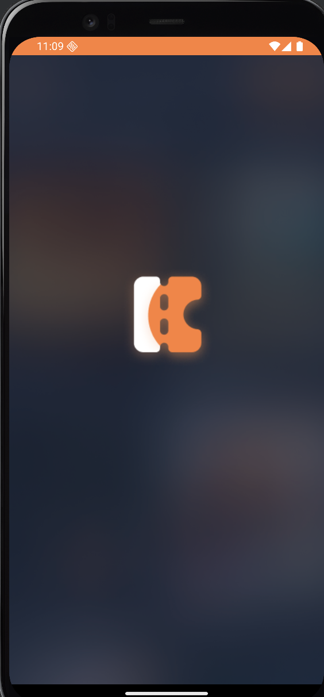
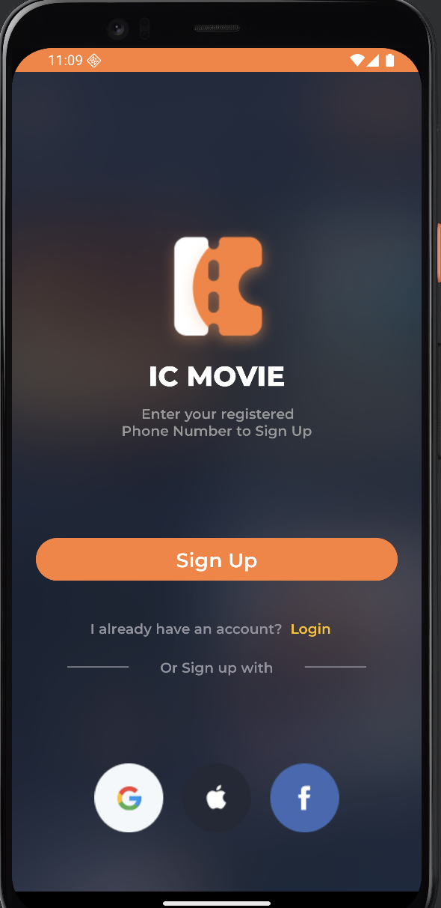
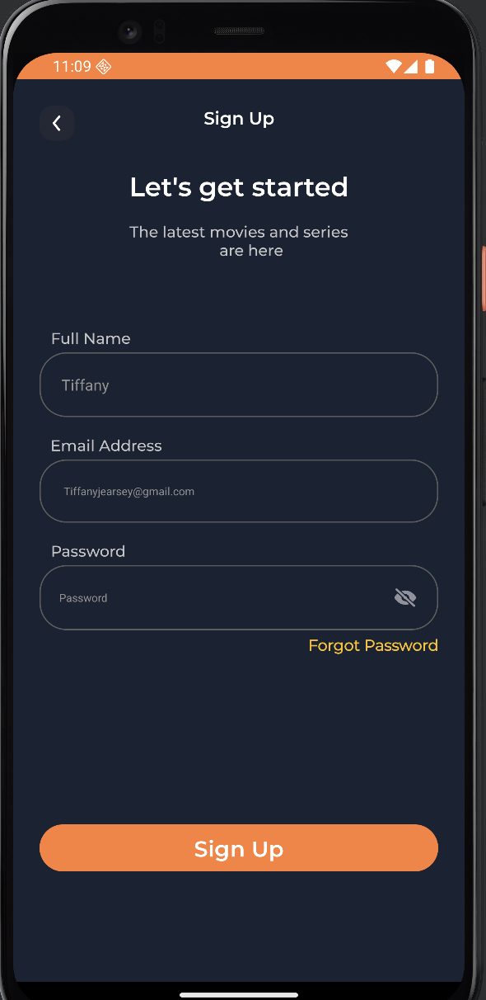
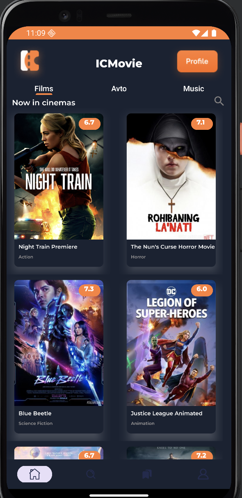
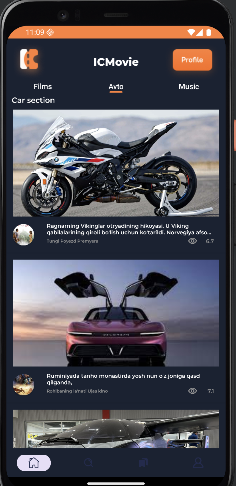
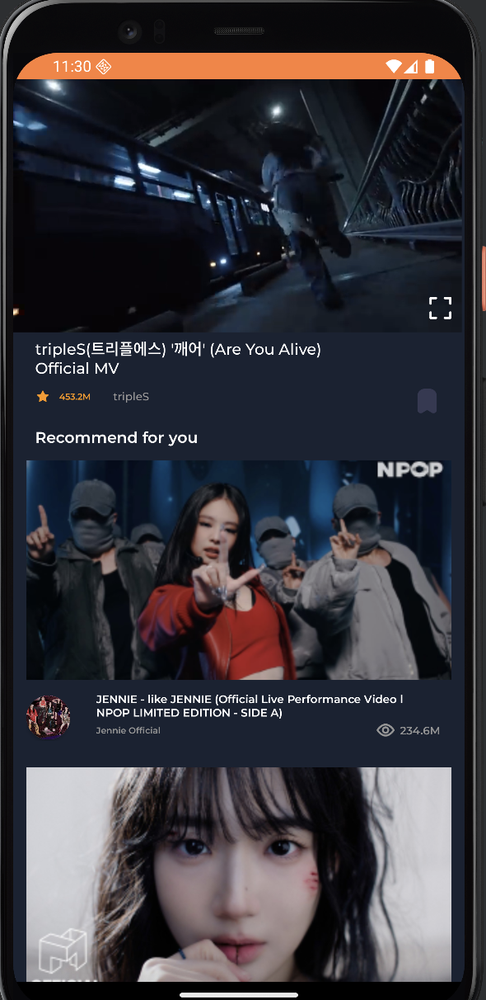
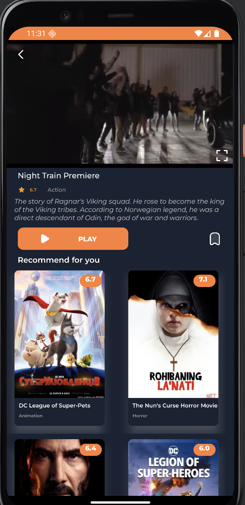
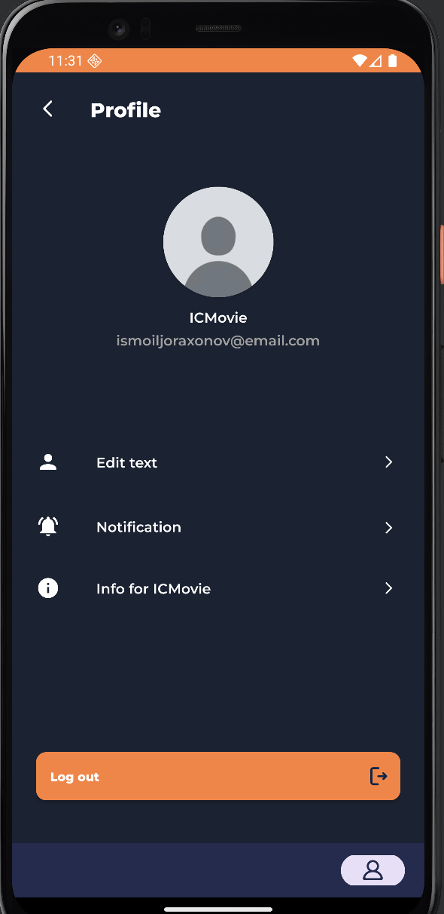

# iCMovie 🎬

**iCMovie** is a Netflix-inspired Android application that allows users to browse and watch movie trailers, car videos, and music clips.  
It was built as a personal project to practice Android development and provide an engaging streaming-like experience.

## ✨ Features
- 🎞️ Browse movie trailers, car videos, and music clips
- 🔍 Search functionality
- 🖥️ Modern UI inspired by Netflix
- 📱 Responsive layout for mobile
- 🔗 Video streaming with API integration

## 📸 Screenshots

<p float="left">
  
  
  
  
  
  
  
  
</p>

## 🛠️ Technologies Used
- **Kotlin** – main language
- **Android Studio** – IDE
- **RecyclerView** – for listing movies and categories
- **ViewBinding** – easier UI handling
- **Glide/Picasso** – for loading images
- **ExoPlayer** – for video playback
- **REST API** – for fetching video data

## 🚀 Installation
1. Clone the repository:
   ```bash
   git clone https://git@github.com:ismoil201/icmovie.git
